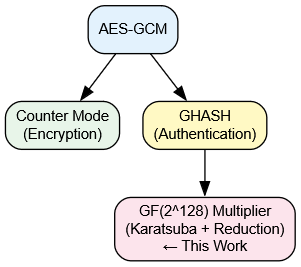
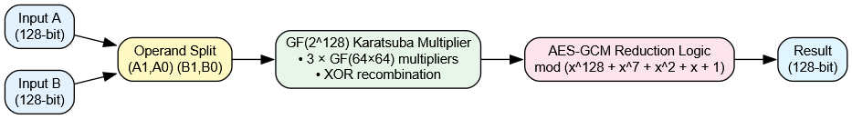
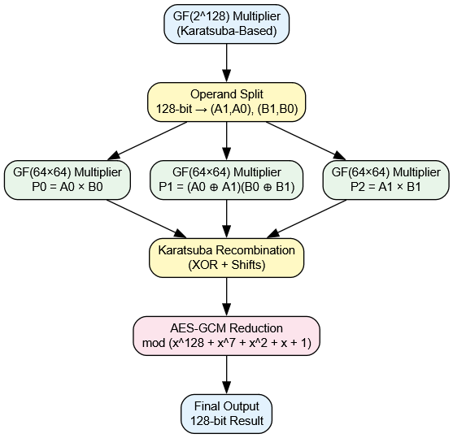

# Optimized GF(2¹²⁸) Multiplier for AES-GCM (GHASH)

## 🎯 Project Goal
The goal of this project is to **design and verify an optimized GF(2¹²⁸) multiplier** suitable for use in the **GHASH authentication block of AES-GCM**, focusing on reduced computational complexity and hardware efficiency.

Only the **GF(2¹²⁸) multiplication datapath** is implemented and optimized in this work.

---

## 📘 Overview
This repository contains the design, implementation, and verification of an **optimized GF(2¹²⁸) multiplier** intended for use inside the **GHASH authentication block of AES-GCM**.

The scope of this work is **limited to the GF(2¹²⁸) multiplication datapath**.  
AES encryption (counter mode), GHASH control logic, and full AES-GCM integration are **not implemented** and are shown only for architectural context.

---

## 🧩 System Context: AES-GCM
AES-GCM consists of two major functional blocks:
- **Counter Mode (CTR)** – Encryption
- **GHASH** – Authentication

This project implements **only the GF(2¹²⁸) multiplier used inside the GHASH block**.

  

---

## 🔧 GF(2¹²⁸) Multiplier – High-Level Datapath
The GF(2¹²⁸) multiplier accepts two 128-bit inputs and produces a 128-bit reduced output as required by AES-GCM.  
The design is optimized using a **Karatsuba-based multiplication approach** followed by **AES-GCM polynomial reduction**.

  

---

## 🌳 Karatsuba-Based Internal Architecture
The internal structure of the multiplier uses Karatsuba decomposition to reduce multiplication complexity.  
The 128-bit operands are split into 64-bit halves and processed using three parallel GF(64×64) polynomial multipliers.

  

**Key architectural points:**
- Operand split: A → (A₁, A₀), B → (B₁, B₀)
- Three GF(64×64) polynomial multipliers:
  - P₀ = A₀ × B₀
  - P₁ = (A₀ ⊕ A₁)(B₀ ⊕ B₁)
  - P₂ = A₁ × B₁
- Karatsuba recombination using XOR and shift operations
- Integrated reduction modulo **x¹²⁸ + x⁷ + x² + x + 1** (AES-GCM polynomial)

---

## ⚙️ Implementation Details
- **HDL:** Verilog RTL
- **Arithmetic Domain:** GF(2)
- **Operations Used:** XOR and AND only
- **Architecture:** Non-pipelined (baseline)
- **Reduction:** Integrated AES-GCM polynomial reduction

---

## 🧪 Verification Methodology
Functional verification is performed using **ModelSim** with self-checking testbenches.

- A naive GF(2¹²⁸) multiplier is implemented as a **golden reference**
- Outputs of the Karatsuba-based multiplier (with reduction) are compared against the reference
- Random and corner-case test vectors are applied

**Result:** Functional correctness verified (PASS for all test cases).

---
## 🧪 Testbenches
Multiple testbenches are included to verify individual modules as well as the integrated design,
including comparison between naive and Karatsuba-based GF(2¹²⁸) multipliers.

---

## 📌 Current Status
- GF(64) polynomial multiplier implemented and verified
- Naive GF(2¹²⁸) multiplier implemented (reference)
- Karatsuba-based GF(2¹²⁸) multiplier implemented
- AES-GCM reduction logic implemented and integrated
- Complete functional verification completed

---

## 🔜 Planned Next Steps
- Introduce pipelining to study frequency and latency improvements
- Perform FPGA synthesis targeting **Intel (Altera) Cyclone IV**
- Compare naive and optimized designs in terms of:
  - Area
  - Timing
  - Latency

---

## 🛠️ Tools Used
- Verilog RTL
- ModelSim (Simulation and Verification)
- Quartus Prime (FPGA Synthesis – planned)

---

## ℹ️ Notes
This repository focuses on a **core cryptographic arithmetic block** for academic study and hardware optimization analysis.  
It does not aim to provide a complete AES-GCM implementation.

---

## 👤 Author
**Syed Faheem**  
M.Tech – VLSI Design  
